# Jak sprawdzić liczbę osób zapisanych na zajęcia?
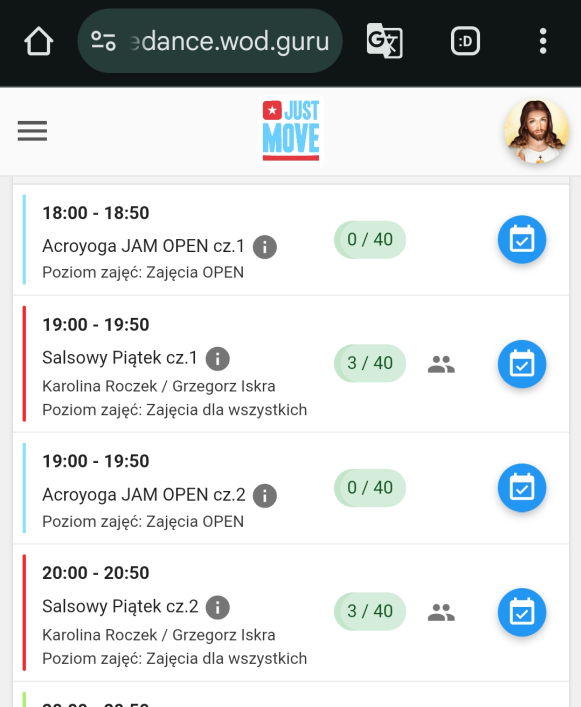

## Na telefonie

1. Zapisz dowolną stronę jako zakładkę.

   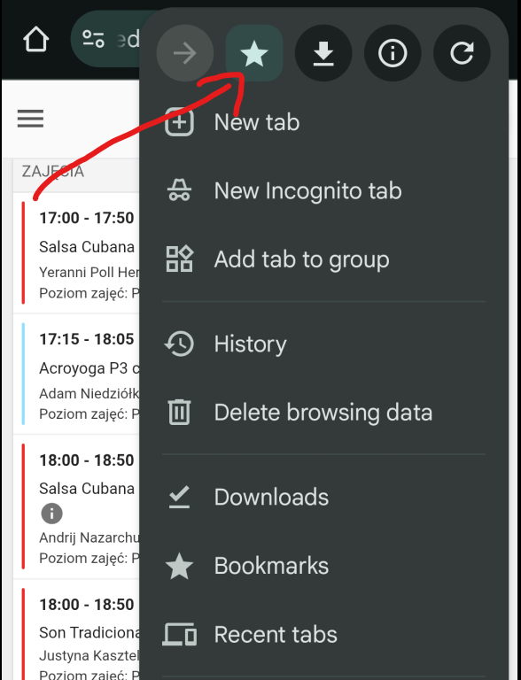
2. Edytuj zakładkę (poświęcamy ją w ofierze) (folder dowolny).

   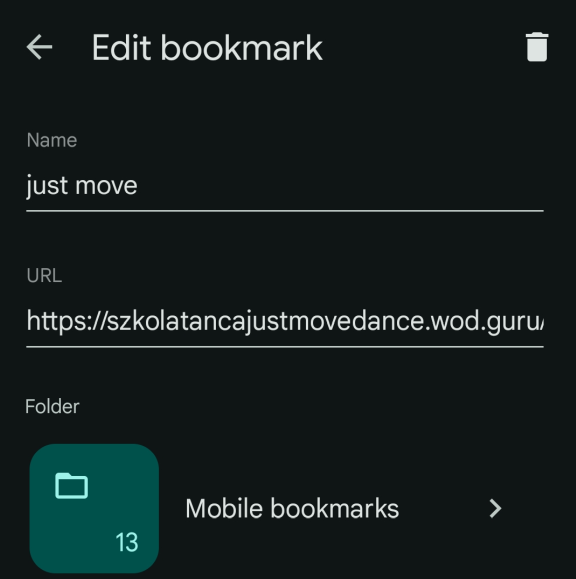
3. Nazwij zakładkę w sposób który zapamiętasz ("attendance", "ludzie", "just move" etc.) i wklej poniższy kod w pole URL (pełny kod [na końcu](#kod), jeśli nie możesz skopiować).

   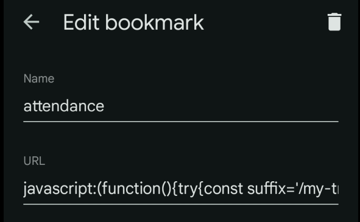

   ```js
   javascript:(()=>{try{let askLocation="\n\nMake sure you're on the right page. Go to your training page?",trainingUrl="https://szkolatancajustmovedance.wod.guru/my-training";var suffix="/my-training/facility-meta/get-hide-attendance",obj;let foundKey=null;for(let i=0;i<localStorage.length;i++){var k=localStorage.key(i);if(k&&k.endsWith(suffix)){foundKey=k;break}}foundKey?(obj=JSON.parse(localStorage.getItem(foundKey)))&&obj.data?(console.log("Before update:",JSON.parse(JSON.stringify(obj))),obj.data.hideAttendance=0,obj.expiration=Date.now()+2592e6,localStorage.setItem(foundKey,JSON.stringify(obj)),console.log("After update:",obj),alert("Attendance visibility has been updated.\n\nReloading page..."),location.reload()):(console.error("Invalid object format for key",foundKey,obj),confirm("⚠️ Found the settings, but it looks broken."+askLocation)&&(location.href=trainingUrl)):(console.error("No matching key found in localStorage"),confirm("⚠️ Could not find attendance settings."+askLocation)&&(location.href=trainingUrl))}catch(e){console.error("Unexpected error:",e),confirm("⚠️ Something went wrong while updating settings."+askLocation)&&(location.href=trainingUrl)}})();
   ```

4. Aby użyć wejdź na stronę `...wod.guru`, kliknij na pasek z adresem strony, znajdź swoją zakładkę, kliknij

    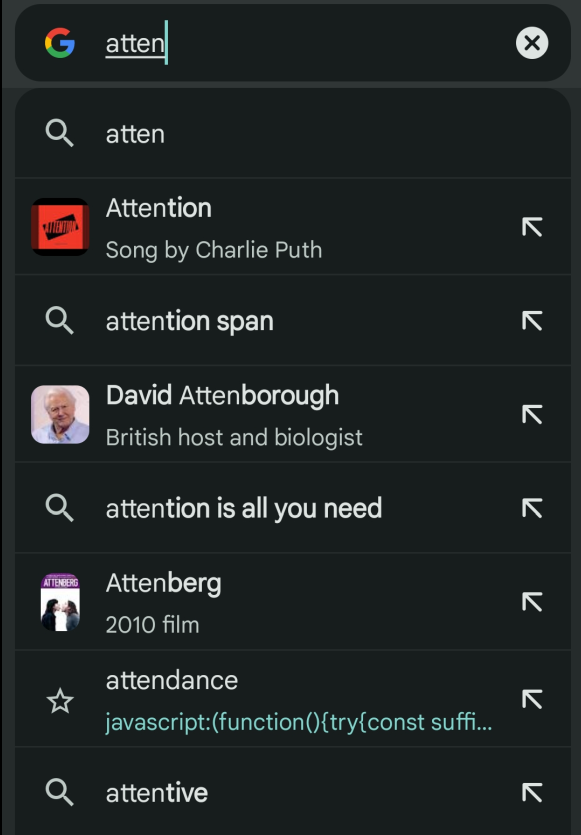

> [!WARNING]
> Kliknięcie na zakładkę na liście zakładek w aplikacji nie działa.
> 
> Wklejenie kodu bezpośrednio w pasek też nie działa

5. Dostaniesz komunikat o sukcesie, i strona zostanie przeładowana

    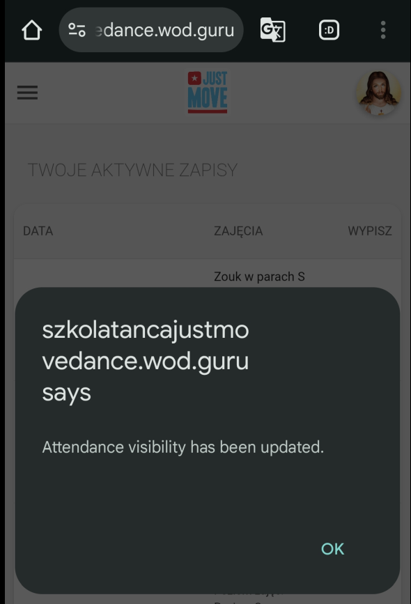

> [!NOTE]
> W przypadku niepowodzenia dostaniesz inny komunikat.

6. Teraz będzie widoczna lista osób na zajęciach.
    Jeśli za kilka dni zobaczysz że nie ma tej listy, powtórz krok 4.

## Na komputerze

1. Dodaj nową zakładkę (prawy przycisk myszy na pasek zakładek)

    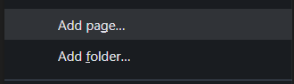
2. Edytuj zakładkę

    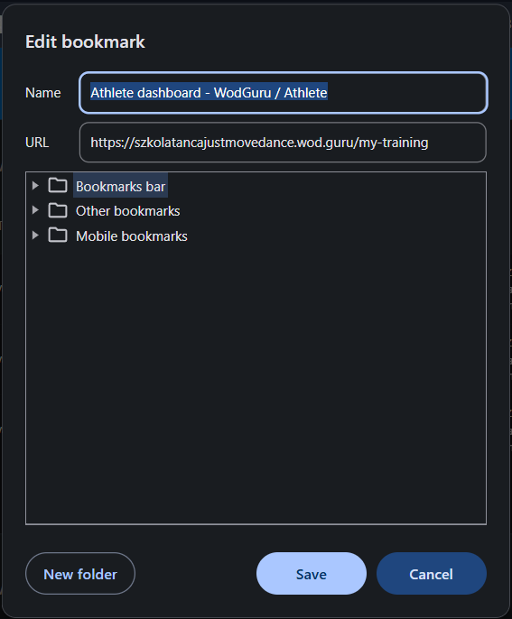
3. Nazwij zakładkę, wklej kod (zobacz [kod](#kod) żeby łatwiej skopiować)

    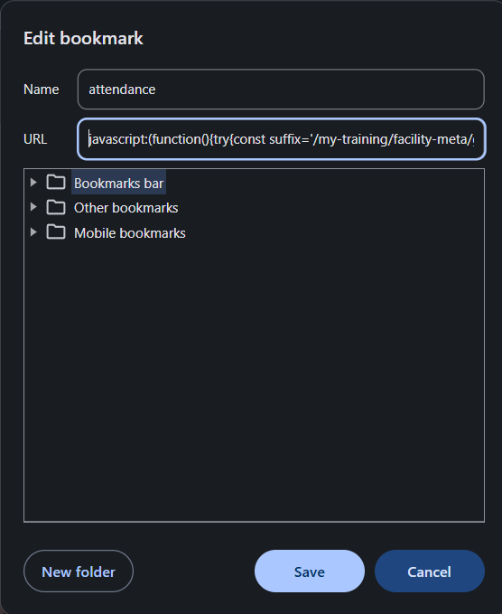

    ```js
    javascript:(()=>{try{let askLocation="\n\nMake sure you're on the right page. Go to your training page?",trainingUrl="https://szkolatancajustmovedance.wod.guru/my-training";var suffix="/my-training/facility-meta/get-hide-attendance",obj;let foundKey=null;for(let i=0;i<localStorage.length;i++){var k=localStorage.key(i);if(k&&k.endsWith(suffix)){foundKey=k;break}}foundKey?(obj=JSON.parse(localStorage.getItem(foundKey)))&&obj.data?(console.log("Before update:",JSON.parse(JSON.stringify(obj))),obj.data.hideAttendance=0,obj.expiration=Date.now()+2592e6,localStorage.setItem(foundKey,JSON.stringify(obj)),console.log("After update:",obj),alert("Attendance visibility has been updated.\n\nReloading page..."),location.reload()):(console.error("Invalid object format for key",foundKey,obj),confirm("⚠️ Found the settings, but it looks broken."+askLocation)&&(location.href=trainingUrl)):(console.error("No matching key found in localStorage"),confirm("⚠️ Could not find attendance settings."+askLocation)&&(location.href=trainingUrl))}catch(e){console.error("Unexpected error:",e),confirm("⚠️ Something went wrong while updating settings."+askLocation)&&(location.href=trainingUrl)}})();
    ```
4. Aby użyć wejdź na stronę `...wod.guru`, kliknij na pasek z adresem strony, znajdź swoją zakładkę, kliknij (wpisz nazwę zakładki w pasek lub kliknij na pasku zakładek).

    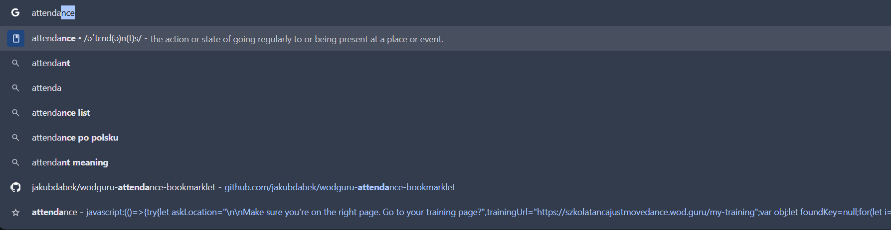
5. Dostaniesz komunikat o sukcesie, i strona zostanie przeładowana

    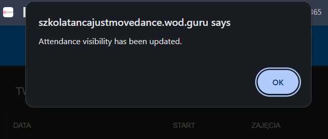

> [!NOTE]
> W przypadku niepowodzenia dostaniesz inny komunikat.

6. Teraz będzie widoczna lista osób na zajęciach.
    Jeśli za kilka dni zobaczysz że nie ma tej listy, powtórz krok 4.

## Kod

Skrócony kod [tutaj](./show-attendance.min.js)

### Pełny kod

[Plik](./show-attendance.js)

```js
javascript:(function () {
    try {
        const askLocation = "\n\nMake sure you're on the right page. Go to your training page?";
        const trainingUrl = 'https://szkolatancajustmovedance.wod.guru/my-training';

        const suffix = '/my-training/facility-meta/get-hide-attendance';
        let foundKey = null;

        /* Find the matching key in localStorage */
        for (let i = 0; i < localStorage.length; i++) {
            const k = localStorage.key(i);
            if (k && k.endsWith(suffix)) {
                foundKey = k;
                break;
            }
        }

        if (!foundKey) {
            console.error('No matching key found in localStorage');
            if (confirm(`⚠️ Could not find attendance settings.${askLocation}`)) {
                location.href = trainingUrl;
            }
            return;
        }

        let obj = JSON.parse(localStorage.getItem(foundKey));
        if (!obj || !obj.data) {
            console.error('Invalid object format for key', foundKey, obj);
            if (confirm(`⚠️ Found the settings, but it looks broken.${askLocation}`)) {
                location.href = trainingUrl;
            }
            return;
        }

        console.log('Before update:', JSON.parse(JSON.stringify(obj)));

        obj.data.hideAttendance = 0;
        obj.expiration = Date.now() + 30 * 24 * 60 * 60 * 1000; /* unix timestamp +30 days */

        localStorage.setItem(foundKey, JSON.stringify(obj));

        console.log('After update:', obj);

        alert('Attendance visibility has been updated.\n\nReloading page...');
        location.reload();
    } catch (e) {
        console.error('Unexpected error:', e);
        if (confirm(`⚠️ Something went wrong while updating settings.${askLocation}`)) {
            location.href = trainingUrl;
        }
    }
})();
```
